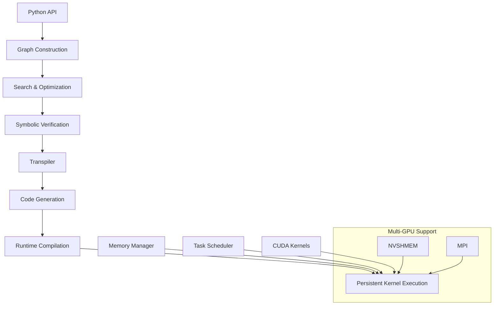

# Mirage Persistent Kernel (MPK) 架构设计文档

## 1. 项目概述

**Mirage Persistent Kernel (MPK)** 是一个先进的编译器和运行时系统，专门用于将大语言模型(LLM)推理转换为高性能的持久化GPU内核(MegaKernel)。该系统通过端到端的GPU融合方法，将LLM推理的延迟降低了1.2×到6.7×。

### 1.1 核心技术原理

MPK采用了以下核心技术：

1. **MegaKernel融合**：将整个LLM推理过程融合到单个GPU内核中，消除了多个内核启动的开销
2. **持久化内核架构**：内核在GPU上持续运行，避免了频繁的内核启动和销毁
3. **多级优化**：在内核级、线程块级和张量级进行深度优化
4. **动态任务调度**：在GPU内部实现高效的任务调度和负载均衡
5. **内存优化**：智能的内存分配和数据布局优化

### 1.2 解决的核心问题

- **内核启动开销**：传统LLM推理需要启动数百个小内核，MPK将其融合为单个MegaKernel
- **内存访问效率**：通过优化数据布局和内存访问模式，减少全局内存访问
- **计算资源利用率**：通过持久化内核和动态调度，提高GPU利用率
- **多GPU通信开销**：优化分布式推理中的通信模式

## 2. 整体架构设计

### 2.1 架构层次图

```
┌─────────────────────────────────────────────────────────────┐
│                    Python API Layer                         │
├─────────────────────────────────────────────────────────────┤
│  ┌─────────────────┐  ┌──────────────────┐  ┌─────────────┐ │
│  │ PersistentKernel│  │   KNGraph        │  │  TBGraph    │ │
│  │     (主接口)     │  │  (内核图)        │  │ (线程块图)   │ │
│  └─────────────────┘  └──────────────────┘  └─────────────┘ │
├─────────────────────────────────────────────────────────────┤
│                   Search & Optimization                     │
├─────────────────────────────────────────────────────────────┤
│  ┌─────────────────┐  ┌──────────────────┐  ┌─────────────┐ │
│  │KernelGraphGen   │  │  SymbolicGraph   │  │  Verifier   │ │
│  │   (图生成器)     │  │   (符号图)       │  │  (验证器)    │ │
│  └─────────────────┘  └──────────────────┘  └─────────────┘ │
├─────────────────────────────────────────────────────────────┤
│                    Transpiler Layer                         │
├─────────────────────────────────────────────────────────────┤
│  ┌─────────────────┐  ┌──────────────────┐  ┌─────────────┐ │
│  │   Transpiler    │  │ NKITranspiler    │  │TritonTrans  │ │
│  │   (主转译器)     │  │ (NeuronCore转译) │  │ (Triton转译)│ │
│  └─────────────────┘  └──────────────────┘  └─────────────┘ │
├─────────────────────────────────────────────────────────────┤
│                     Runtime System                          │
├─────────────────────────────────────────────────────────────┤
│  ┌─────────────────┐  ┌──────────────────┐  ┌─────────────┐ │
│  │ PersistentKernel│  │ TaskScheduler    │  │MemoryMgr   │ │
│  │   (运行时)       │  │  (任务调度)      │  │ (内存管理)   │ │
│  └─────────────────┘  └──────────────────┘  └─────────────┘ │
├─────────────────────────────────────────────────────────────┤
│                      CUDA Kernels                           │
├─────────────────────────────────────────────────────────────┤
│  ┌─────────────────┐  ┌──────────────────┐  ┌─────────────┐ │
│  │   Attention     │  │    Linear        │  │   Norm      │ │
│  │   (注意力)       │  │   (线性层)       │  │  (归一化)    │ │
│  └─────────────────┘  └──────────────────┘  └─────────────┘ │
│  ┌─────────────────┐  ┌──────────────────┐  ┌─────────────┐ │
│  │    MoE          │  │   AllReduce      │  │  Embedding  │ │
│  │ (专家混合)       │  │   (全局归约)     │  │  (嵌入层)    │ │
│  └─────────────────┘  └──────────────────┘  └─────────────┘ │
└─────────────────────────────────────────────────────────────┘
```

### 2.2 模块间交互关系



## 3. 核心模块详细设计

### 3.1 Python API层 (python/mirage/)

**核心类：PersistentKernel**
- **职责**：提供用户友好的Python接口，管理整个MegaKernel的生命周期
- **关键方法**：
  - `attach_input()`: 附加PyTorch张量作为输入
  - `new_tensor()`: 创建新的中间张量
  - `compile()`: 编译计算图为CUDA代码
  - `__call__()`: 执行编译后的MegaKernel

**技术原理**：
```python
# 核心API设计
mpk = mi.PersistentKernel(
    world_size=world_size,
    mpi_rank=rank,
    num_workers=96,
    num_local_schedulers=48,
    meta_tensors=[step, tokens],
)
```

### 3.2 图构建层 (include/mirage/kernel/ & include/mirage/threadblock/)

#### 3.2.1 KNGraph (内核图)
- **职责**：表示设备级别的计算图，管理DTensor（设备张量）之间的操作
- **核心组件**：
  - `DTensor`: 设备内存中的张量表示
  - `KNOperator`: 内核级操作符（矩阵乘法、元素操作等）
  - `Graph`: 管理操作符的执行顺序和依赖关系

#### 3.2.2 TBGraph (线程块图)
- **职责**：表示线程块级别的计算图，管理STensor（共享内存张量）之间的操作
- **核心组件**：
  - `STensor`: 共享内存中的张量表示
  - `TBOperator`: 线程块级操作符
  - `Graph`: 管理线程块内的计算流程

**技术原理**：
- 采用两级图表示：内核图描述全局计算流，线程块图描述局部计算细节
- 支持复杂的融合操作，如`rmsnorm_linear_layer`融合RMSNorm和线性层

### 3.3 搜索优化层 (include/mirage/search/)

#### 3.3.1 KernelGraphGenerator
- **职责**：自动生成和优化内核图
- **核心算法**：
  - 符号执行：使用符号图进行抽象计算
  - 启发式搜索：基于代价模型的图优化
  - 验证机制：确保生成图的正确性

#### 3.3.2 SymbolicGraph
- **职责**：提供符号级别的图表示和操作
- **技术原理**：
  - 使用Z3求解器进行符号约束求解
  - 支持抽象表达式的等价性验证
  - 实现维度约束的传播和推理

#### 3.3.3 Verifier (验证系统)
- **职责**：验证生成的计算图的正确性
- **验证方法**：
  - 概率验证：随机输入测试
  - 形式化验证：基于Z3的符号验证
  - 输出匹配：与参考实现对比

### 3.4 转译器层 (include/mirage/transpiler/)

#### 3.4.1 主转译器 (Transpiler)
- **职责**：将优化后的计算图转换为高效的CUDA代码
- **核心功能**：
  - 张量布局优化
  - 内存分配规划
  - 融合操作识别
  - 线程块调度优化

**技术原理**：
```cpp
class Transpiler {
private:
    std::shared_ptr<kn::Graph> g;
    TranspilerConfig config;
    
    void resolve_dtensor_meta();      // 解析张量元数据
    void resolve_tensor_layout();     // 优化张量布局
    void resolve_tb_fusion();         // 解析融合操作
    void plan_dtensor_memory();       // 规划内存分配
};
```

#### 3.4.2 专用转译器
- **NKITranspiler**: 针对NeuronCore的转译器
- **TritonTranspiler**: 针对Triton的转译器
- **支持多种后端**：CUDA、Triton、NeuronCore

### 3.5 运行时系统 (include/mirage/persistent_kernel/)

#### 3.5.1 持久化内核运行时
- **核心特性**：
  - 内核持续运行，避免启动开销
  - 动态任务调度
  - 多GPU协调
  - 内存池管理

**技术原理**：
```cpp
// 持久化内核主循环
__global__ void persistent_kernel(RuntimeConfig config) {
    while (!should_terminate()) {
        TaskId task_id = get_next_task();
        execute_task(task_id, config);
        update_dependencies();
    }
}
```

#### 3.5.2 任务调度系统
- **调度策略**：
  - 工作窃取算法
  - 优先级调度
  - 负载均衡

#### 3.5.3 内存管理
- **内存优化**：
  - 内存池分配
  - 张量生命周期管理
  - NVSHMEM支持多GPU内存访问

### 3.6 CUDA内核层 (include/mirage/persistent_kernel/tasks/)

#### 3.6.1 专用内核实现
- **Attention内核**：
  - 多头注意力 (Multi-Head Attention)
  - 分组查询注意力 (Group Query Attention)
  - 页式注意力 (Paged Attention)
  - 推测解码注意力

- **线性层内核**：
  - 融合RMSNorm+Linear
  - SiLU激活+乘法+Linear
  - LoRA适应层

- **专家混合(MoE)内核**：
  - 动态专家选择
  - 负载均衡

- **通信内核**：
  - AllReduce操作
  - NVSHMEM通信

#### 3.6.2 架构特定优化
- **Hopper架构**：使用TMA和WGMMA指令
- **Blackwell架构**：针对新架构的优化
- **通用架构**：兼容性实现

## 4. 关键技术实现

### 4.1 内核融合技术

**融合策略**：
- 垂直融合：将连续的操作融合到单个内核
- 水平融合：并行执行独立的操作
- 循环融合：将循环操作融合优化

**示例融合操作**：
```cpp
// RMSNorm + Linear融合
__device__ void rmsnorm_linear_fused(
    float* input, float* weight_norm, float* weight_linear,
    float* output, int hidden_size) {
    // 在同一个内核中完成归一化和线性变换
}
```

### 4.2 内存优化策略

**内存层次优化**：
- 全局内存：输入输出张量
- 共享内存：线程块间共享数据
- 寄存器：线程私有数据

**数据布局优化**：
- 行优先vs列优先布局选择
- 内存对齐优化
- 缓存友好的访问模式

### 4.3 多GPU支持

**分布式策略**：
- NVSHMEM：GPU间直接内存访问
- MPI：进程间通信协调
- AllReduce优化：环形或树形通信拓扑

### 4.4 动态调度算法

**调度组件**：
- Worker线程：执行计算任务
- Local Scheduler：本地任务调度
- Remote Scheduler：跨GPU任务调度

**调度算法**：
```cpp
__device__ TaskId get_next_task(RuntimeConfig& config) {
    // 1. 检查本地队列
    // 2. 工作窃取
    // 3. 远程任务获取
    // 4. 返回有效任务ID或等待
}
```

## 5. 性能优化机制

### 5.1 编译时优化

- **图级优化**：操作融合、冗余消除
- **内存优化**：生命周期分析、内存复用
- **调度优化**：依赖分析、并行度最大化

### 5.2 运行时优化

- **动态负载均衡**：根据实际执行情况调整任务分配
- **内存预取**：提前加载下一批数据
- **流水线执行**：计算和通信重叠

### 5.3 架构特定优化

- **Tensor Core利用**：混合精度计算
- **异步执行**：CUDA流并行
- **内存带宽优化**：合并内存访问

## 6. 系统集成与扩展

### 6.1 与深度学习框架集成

**PyTorch集成**：
- 无缝的张量转换
- 自动梯度计算支持
- 模型加载和保存

**Hugging Face集成**：
- 直接从模型仓库加载
- 标准化的模型接口

### 6.2 可扩展性设计

**新操作符添加**：
- 标准化的操作符接口
- 自动代码生成框架

**新硬件支持**：
- 抽象的硬件接口层
- 可插拔的后端实现

## 7. 质量保证体系

### 7.1 测试框架

- **单元测试**：每个模块的独立测试
- **集成测试**：端到端的功能测试
- **性能测试**：基准测试和回归测试

### 7.2 验证机制

- **数值正确性**：与参考实现对比
- **性能验证**：延迟和吞吐量测试
- **内存安全**：内存泄漏和越界检查

## 8. 总结

Mirage Persistent Kernel代表了LLM推理优化的重要突破，通过创新的MegaKernel架构和多级优化策略，显著提升了推理性能。其模块化的设计使得系统具有良好的可扩展性和可维护性，为未来的优化和功能扩展奠定了坚实基础。

### 8.1 技术创新点

1. **MegaKernel融合**：业界首个将完整LLM推理融合为单内核的系统
2. **持久化架构**：避免内核启动开销的创新设计
3. **多级优化**：从张量到内核的全栈优化
4. **智能调度**：GPU内部的动态任务调度
5. **符号验证**：基于形式化方法的正确性保证

### 8.2 应用价值

- **显著性能提升**：1.2×到6.7×的延迟降低
- **资源利用率提升**：更高的GPU利用率
- **开发效率**：简化的API和自动优化
- **可扩展性**：支持多GPU和大规模部署

这个架构设计为高性能LLM推理提供了完整的解决方案，是深度学习系统优化领域的重要贡献。