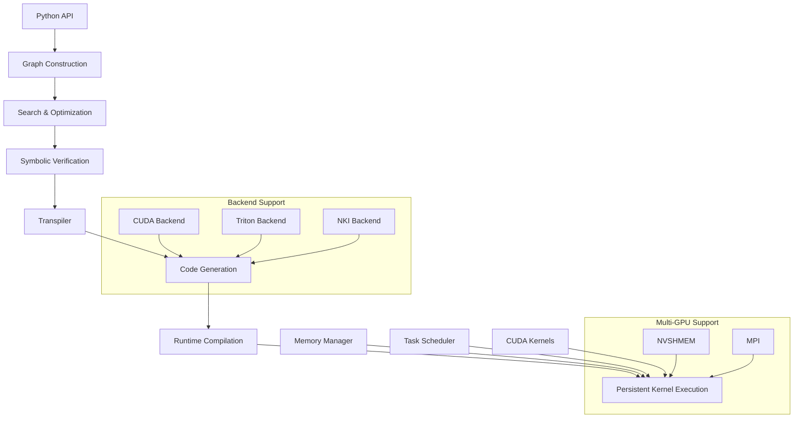

# 整体架构设计

## 🏗️ 架构概览

Mirage Persistent Kernel采用分层架构设计，从用户接口到底层CUDA内核共分为8个主要层次，每层职责明确，接口清晰。

## 📊 架构层次图

```
┌─────────────────────────────────────────────────────────────┐
│                    Python API Layer                         │
│  ┌─────────────────┐  ┌──────────────────┐  ┌─────────────┐ │
│  │ PersistentKernel│  │   KNGraph        │  │  TBGraph    │ │
│  │     (主接口)     │  │  (内核图)        │  │ (线程块图)   │ │
│  └─────────────────┘  └──────────────────┘  └─────────────┘ │
├─────────────────────────────────────────────────────────────┤
│                   Graph Construction Layer                  │
│  ┌─────────────────┐  ┌──────────────────┐  ┌─────────────┐ │
│  │   DTensor       │  │    STensor       │  │  Operators  │ │
│  │  (设备张量)      │  │  (共享内存张量)   │  │  (操作符)    │ │
│  └─────────────────┘  └──────────────────┘  └─────────────┘ │
├─────────────────────────────────────────────────────────────┤
│                   Search & Optimization                     │
│  ┌─────────────────┐  ┌──────────────────┐  ┌─────────────┐ │
│  │KernelGraphGen   │  │  SymbolicGraph   │  │  Verifier   │ │
│  │   (图生成器)     │  │   (符号图)       │  │  (验证器)    │ │
│  └─────────────────┘  └──────────────────┘  └─────────────┘ │
├─────────────────────────────────────────────────────────────┤
│                    Transpiler Layer                         │
│  ┌─────────────────┐  ┌──────────────────┐  ┌─────────────┐ │
│  │   Transpiler    │  │ NKITranspiler    │  │TritonTrans  │ │
│  │   (主转译器)     │  │ (NeuronCore转译) │  │ (Triton转译)│ │
│  └─────────────────┘  └──────────────────┘  └─────────────┘ │
├─────────────────────────────────────────────────────────────┤
│                     Runtime System                          │
│  ┌─────────────────┐  ┌──────────────────┐  ┌─────────────┐ │
│  │ PersistentKernel│  │ TaskScheduler    │  │ MemoryMgr   │ │
│  │   (运行时)       │  │  (任务调度)      │  │ (内存管理)   │ │
│  └─────────────────┘  └──────────────────┘  └─────────────┘ │
├─────────────────────────────────────────────────────────────┤
│                      CUDA Kernels                           │
│  ┌─────────────────┐  ┌──────────────────┐  ┌─────────────┐ │
│  │   Attention     │  │    Linear        │  │   Norm      │ │
│  │   (注意力)       │  │   (线性层)       │  │  (归一化)    │ │
│  └─────────────────┘  └──────────────────┘  └─────────────┘ │
│  ┌─────────────────┐  ┌──────────────────┐  ┌─────────────┐ │
│  │    MoE          │  │   AllReduce      │  │  Embedding  │ │
│  │ (专家混合)       │  │   (全局归约)     │  │  (嵌入层)    │ │
│  └─────────────────┘  └──────────────────┘  └─────────────┘ │
└─────────────────────────────────────────────────────────────┘
```

## 🔄 模块间交互流程



## 🎯 各层职责定义

### 1. Python API Layer (用户接口层)
**核心职责**：
- 提供用户友好的Python接口
- 管理计算图的构建和执行
- 处理PyTorch张量的集成

**主要组件**：
- `PersistentKernel`: 主要用户接口
- `KNGraph`: 内核级计算图
- `TBGraph`: 线程块级计算图

### 2. Graph Construction Layer (图构建层)
**核心职责**：
- 表示和管理计算图结构
- 定义张量和操作符的抽象
- 支持复杂的融合操作

**主要组件**：
- `DTensor`: 设备内存张量
- `STensor`: 共享内存张量
- `Operators`: 各种计算操作符

### 3. Search & Optimization Layer (搜索优化层)
**核心职责**：
- 自动搜索最优的计算图结构
- 执行图级别的优化变换
- 验证优化后图的正确性

**主要组件**：
- `KernelGraphGenerator`: 图生成和优化引擎
- `SymbolicGraph`: 符号级图表示
- `Verifier`: 正确性验证系统

### 4. Transpiler Layer (转译器层)
**核心职责**：
- 将优化后的图转换为目标代码
- 支持多种后端目标平台
- 执行平台特定的优化

**主要组件**：
- `Transpiler`: 主转译器
- `NKITranspiler`: NeuronCore转译器
- `TritonTranspiler`: Triton转译器

### 5. Runtime System (运行时系统)
**核心职责**：
- 管理持久化内核的生命周期
- 实现动态任务调度
- 处理内存分配和管理

**主要组件**：
- `PersistentKernel`: 运行时内核管理
- `TaskScheduler`: 任务调度器
- `MemoryManager`: 内存管理器

### 6. CUDA Kernels (内核实现层)
**核心职责**：
- 实现高性能的CUDA内核
- 支持各种LLM操作
- 针对不同架构优化

**主要组件**：
- 注意力内核（Multi-Head、Group Query、Paged）
- 线性层内核（融合RMSNorm、SiLU等）
- 专家混合(MoE)内核
- 通信内核（AllReduce等）

## 🔗 数据流和控制流

### 编译时数据流
```
用户代码 → Python API → 计算图构建 → 图优化搜索 → 
符号验证 → 代码转译 → CUDA代码生成 → 编译
```

### 运行时数据流
```
输入张量 → 内存分配 → 任务调度 → 内核执行 → 
结果收集 → 输出张量
```

### 控制流管理
```
主线程控制 → 任务分发 → GPU内核调度 → 
依赖管理 → 同步协调 → 结果汇总
```

## 🏛️ 架构设计原则

### 1. 分层解耦
- **职责分离**：每层专注于特定功能
- **接口标准**：层间通过清晰接口通信
- **独立演进**：各层可独立优化和扩展

### 2. 模块化设计
- **高内聚**：相关功能聚合在同一模块
- **低耦合**：模块间依赖最小化
- **可替换**：支持不同实现的替换

### 3. 可扩展性
- **水平扩展**：支持新的操作符和优化
- **垂直扩展**：支持新的硬件平台
- **功能扩展**：支持新的应用场景

### 4. 性能优先
- **零拷贝**：最小化数据拷贝开销
- **并行执行**：充分利用并行计算资源
- **内存优化**：智能的内存分配和复用

## 🔧 关键技术决策

### 1. 两级图表示
**决策**：采用KNGraph和TBGraph的两级表示
**原因**：
- 分离关注点：内核级关注全局优化，线程块级关注局部优化
- 优化空间：不同层次有不同的优化机会
- 代码生成：便于生成高效的CUDA代码

### 2. 符号执行验证
**决策**：使用Z3求解器进行符号验证
**原因**：
- 正确性保证：确保优化不改变语义
- 自动化程度高：减少手动验证工作
- 覆盖率高：能够验证复杂的变换

### 3. 持久化内核架构
**决策**：采用持久化内核而非传统的内核启动模式
**原因**：
- 性能优势：避免内核启动开销
- 动态调度：支持运行时的任务调度
- 资源利用：更好的GPU资源利用率

### 4. 多后端支持
**决策**：支持CUDA、Triton、NKI多种后端
**原因**：
- 平台适应：适应不同的硬件平台
- 技术演进：跟上GPU编程技术发展
- 性能对比：选择最优的实现方式

## 📈 架构演进路径

### Phase 1: 基础架构
- 建立核心的分层架构
- 实现基本的图表示和转译
- 支持核心的LLM操作

### Phase 2: 优化增强
- 完善搜索优化算法
- 增加更多的融合模式
- 提升性能和稳定性

### Phase 3: 生态扩展
- 支持更多硬件平台
- 集成更多深度学习框架
- 建立完整的工具链

### Phase 4: 标准化
- 制定行业标准
- 建立基准测试套件
- 推广最佳实践

## 🎯 架构优势

### 技术优势
- **自动化程度高**：从图构建到代码生成全自动
- **优化效果好**：多级优化策略效果显著
- **扩展性强**：支持新操作和新硬件
- **正确性保证**：严格的验证机制

### 工程优势
- **开发效率高**：简单的API和丰富的示例
- **维护成本低**：清晰的模块划分和文档
- **调试友好**：完善的日志和诊断工具
- **测试完备**：多层次的测试覆盖

这个架构设计为高性能LLM推理提供了坚实的技术基础，是系统成功的关键因素。